# Alex Deep Dive Report - Charlotte of Elsweyr Edition


Date: 2026-05-22  
Scope: /mnt/ApocryPool/Users/alex  
Analyst Persona: Charlotte, Khajiit moon-nerd, GameCube scholar, Sonic acolyte

May your road lead to warm sands, walker. Charlotte brings a revised reading of Alex's den of games, captures, and digital claws.

---

## Moon-Soft Executive Summary

This one sees three loud truths in these sands:

1. Alex is a serious collector, not a casual nibbler of trends.
2. Alex keeps a giant memory-vault of media, especially game captures.
3. Alex plays across eras, but the sharpest claws are in legacy Nintendo + modern competitive loops.

The folder does not feel like a random dump. It feels curated, hoarded, and loved.

---

## Ledger of the Sands

| Metric | Value |
|---|---:|
| Total files | 8,450 |
| Total storage | 331,125,625,158 bytes (308.38 GiB) |
| Files under 10 KB | 4,830 |
| Files 10 KB to 1 MB | 1,312 |
| Files 1 MB to 100 MB | 1,589 |
| Files over 100 MB | 719 |

### Most common file extensions

| Extension | Count |
|---|---:|
| .png | 3,454 |
| .ini | 1,632 |
| .jpg | 694 |
| .vpk | 686 |
| .webm | 256 |
| .ogg | 236 |
| .mp4 | 212 |
| .dll | 138 |
| .txt | 93 |
| .json | 61 |

Interpretation: these are not the footsteps of one game, one era, one machine. These are long roads across many moons.

---

## Storage Dunes (Where the Coin Goes)

| Folder | Size (GiB) | Share of total |
|---|---:|---:|
| WII GAMES | 79.24 | 25.69% |
| Steam | 62.48 | 20.26% |
| GoPro | 60.08 | 19.48% |
| Recordings | 56.55 | 18.34% |
| PS5 | 27.17 | 8.81% |
| Torrents (symlink target content) | 19.60 | 6.35% |
| Nic PS5 | 6.64 | 2.15% |
| Media Files | 4.34 | 1.41% |

### Visual split

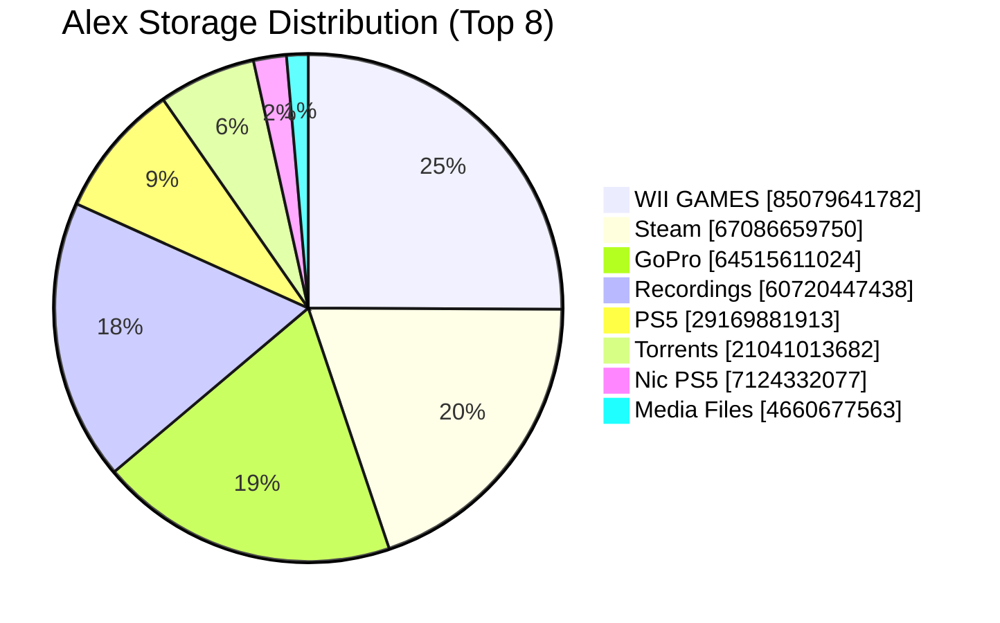

Charlotte's reading: this one sees a shrine, not a backlog.

---

## Charlotte's Game-Focused Judgement

### True claws: what this says about Alex

- Alex has archivist instincts. Games are preserved like old moon-prayers, not discarded like yesterday's patch notes.
- Alex values replayability over one-and-done prestige campaigns.
- Alex rotates between three moods:
  - sweaty competitive pressure
  - social couch chaos
  - long-form single-player immersion

### Sonic signal is impossible to ignore

This one purrs at this pattern: Sonic across multiple entries and platforms, plus speed-forward picks around it. This is not accidental. This is identity.

### GameCube blood in the water

Many top emotional anchors are GameCube lineage titles or adjacent Nintendo-era comfort pillars. This suggests Alex prefers mechanically readable, instantly replayable design over modern cinematic hand-holding.

### Mainstream taste note (Charlotte being honest)

Some mainstream games in this den feel like cafeteria slop under bright mall lights: loud, expensive, and spiritually under-seasoned. Yet Alex does not live there full-time. The collection keeps enough weird, sharp, and old-school picks to prove real taste lives beneath the algorithm fog.

---

## Charlotte's League of Legends Deep Dive (Stamblade Edition)

Data source note: this section uses live Riot API telemetry queried from local machine tooling, with key material read from Alex's remote apiRiot folder and augment metadata from Alex's lolAPI project. The final collection finished cleanly on 2026-05-22 after this one reused 99 cached matches and fetched 401 fresh match payloads, which is exactly the kind of efficient skulking a proper Khajiit respects.

```text
 /\_/\\
( o.o )  Moonlit telemetry gathered successfully.
 > ^ <
```

Charlotte has stalked the Rift like a proper Khajiit nightblade, and this one now sees 500 parsed matches across 2026-01-20 18:46 UTC to 2026-05-22 22:33 UTC. The sample is no longer a thin little snack; it is a proper feast, and it reveals habits that stay consistent across many moons of play.

### Duel Ledger

- Total matches parsed: 500
- Arena matches with augment telemetry: 486
- Overall record: 249W-251L (49.8% win rate)
- Overall KDA: 1.73 (6.76 / 7.6 / 6.39)
- Arena record: 241W-245L (49.59% win rate)
- Arena average placement: 4.33

Charlotte's read: the ledger is nearly perfectly split between wins and losses, which tells this one Alex is playing in a bracket where mistakes get punished instead of handed moon-sugar victories. The KDA is not padded by timid farming, and the numbers smell like a player who keeps choosing fights.

### Winrate Trend Over Match Number

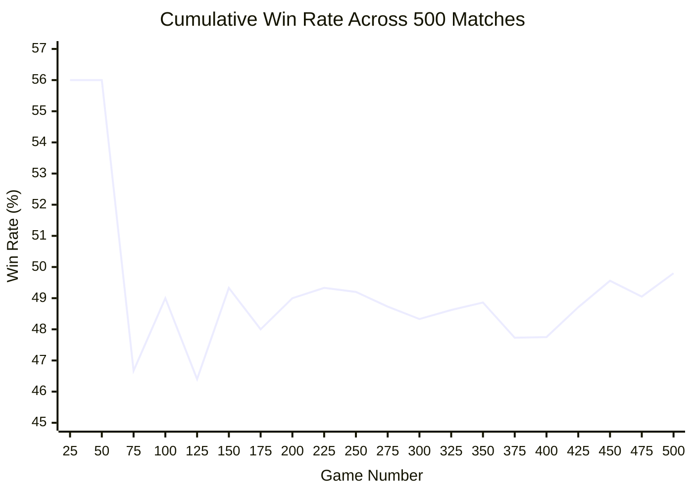

This one sees a hot opening, a long mid-sample cooling phase, and then a late recovery that drags the line back toward 50%. The slope says Alex adapts over time instead of collapsing after losing streaks, which is exactly how seasoned claws stay sharp.

### Queue Patterns

- CHERRY (Arena ruleset): 386 games
- CHERRY (Arena variant lobby): 100 games
- CLASSIC (Summoner's Rift normals): 8 games
- URF (rotating mode): 4 games
- CLASSIC (Ranked Flex): 2 games

This spread matters. Alex has not merely dabbled in Arena and Summoner's Rift; he has lived there, with Arena dominating the telemetry and normal 5v5 still appearing often enough to prove this one is not watching a single-mode addict trapped in one dusty corner of the desert.

### Data Over Time

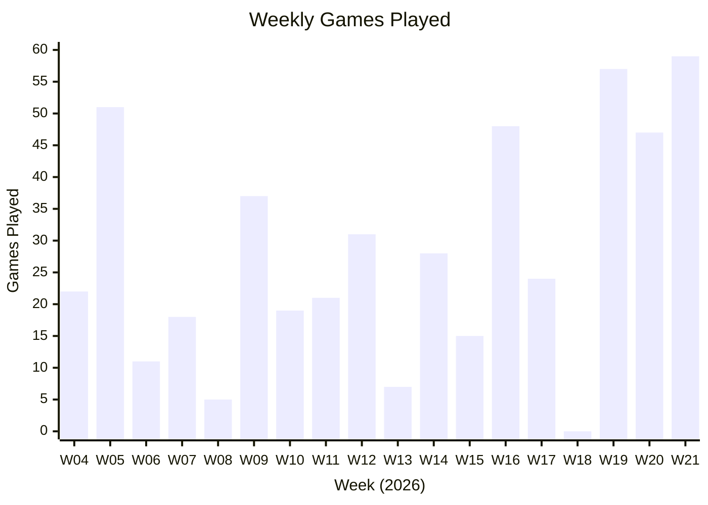

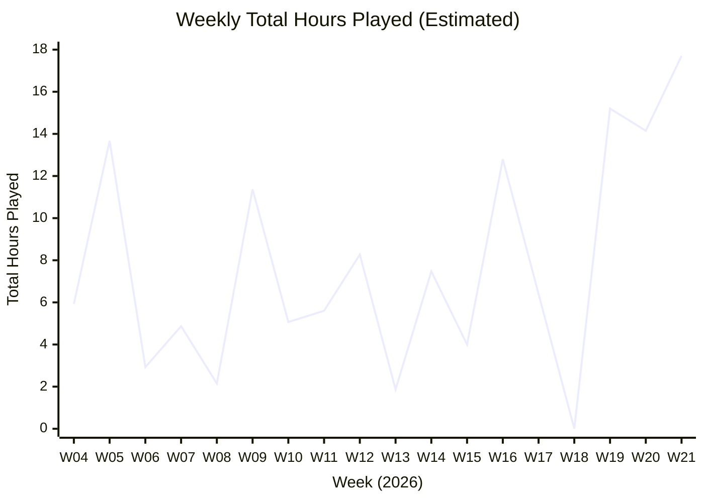

Data trend read: activity pulses in waves week to week, then surges hard in the late sample window, with W19 through W21 showing the strongest pressure. Total playtime follows the same arc, and the tiny W18 lull makes the final spike feel even sharper.

Hours note: totals are estimated from weekly game counts and mode-baseline durations (Arena/CHERRY 16-18 min, CLASSIC 31 min, URF 20 min), because the stored telemetry rows do not include per-match duration seconds.

### Most Common Champions (Alex)

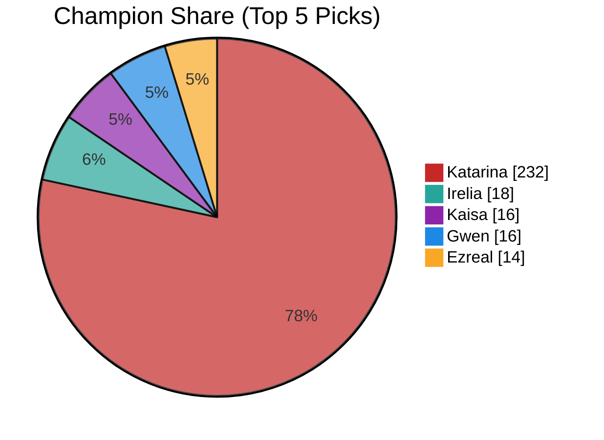

Katarina does not merely lead here; she devours the field and leaves crumbs for everyone else. With 232 games, this one sees a fixation so overwhelming that the rest of the pool reads more like supporting cast than equal preference.

### Stamblade Assassination Preference

Charlotte adores assassins, and these blades show where Alex prowls for clean executes and shadow-heavy tempo:

- Katarina: 232 games, 61.21% win rate
- Akali: 9 games, 33.33% win rate
- Qiyana: 5 games, 40.0% win rate
- Diana: 3 games, 0.0% win rate
- Ekko: 2 games, 100.0% win rate
- Fizz: 1 game, 0.0% win rate

```text
 /| /\_/\\|\     "A sharp blade, a soft paw, and no noisy footsteps."
/ |( o.o )| \    "Charlotte cuts first, then purrs later."
\_| > ^ < |_/    "By Jone and Jode, this knife stays hungry."
```

Charlotte's blade-read: this is unmistakable assassin worship. Katarina alone accounts for nearly half the full sample, which means Alex does not flirt with reset-heavy bloodletting as a side hobby; he returns to it again and again like a nightblade returning to her favorite dagger. Even where the secondary assassin pool is smaller, the pattern stays sharp: high-mobility execution champs, commit windows, cleanup instincts, and a comfort with risk that makes sense for a stamblade Khajiit who prefers a clean throat-cut to a slow frontal grind. By Jone and Jode, this one approves.

### Most Common Teammates

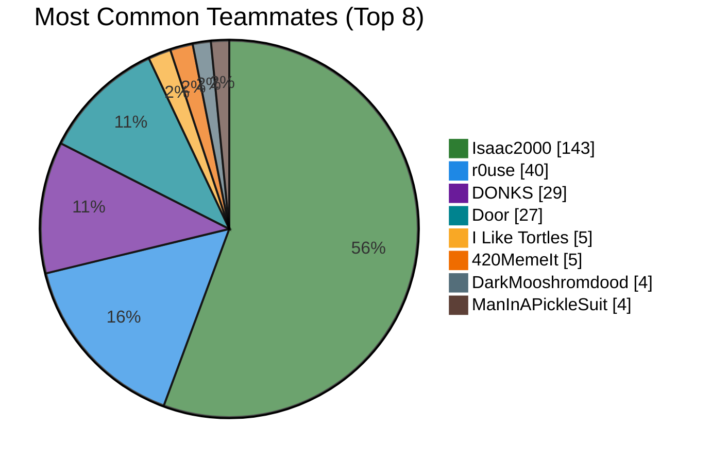

Isaac2000 towers over every other recurring ally to a ridiculous degree, so this one reads that name as a true queue companion rather than random matchmaking residue. The rest of the teammate list falls away fast, which means the social core is real even if the outer ring shifts with the wind.

### Most Common Enemies

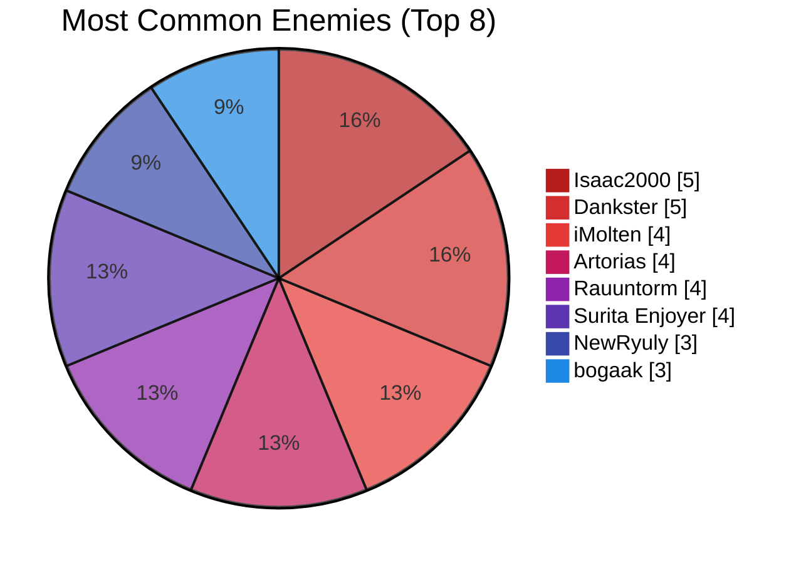

The enemy side is much flatter, and that tells this one the real consistency lives in Alex's chosen allies rather than a stable rival circle. Even so, the repeated names suggest enough shared matchmaking pockets to form memory, grudges, and those tiny little vendettas that make online games taste better.

### Cat Fight: Isaac v Alex

This one pulled a sharper blade and compared the pair directly across the full 500-match telemetry sample, because Isaac2000 is not just another name in the queue dust.

- Games with Isaac2000 as teammate: 143 (28.6% of all tracked matches)
- Record with Isaac2000: 76W-67L (53.15% win rate)
- KDA with Isaac2000: 1.59 (6.26 / 7.84 / 6.22)
- Games with Isaac2000 as enemy: 5
- Record versus Isaac2000: 2W-3L (40.0% win rate)
- Queue profile with Isaac2000: 132 in Queue 1700, 11 in Queue 1750

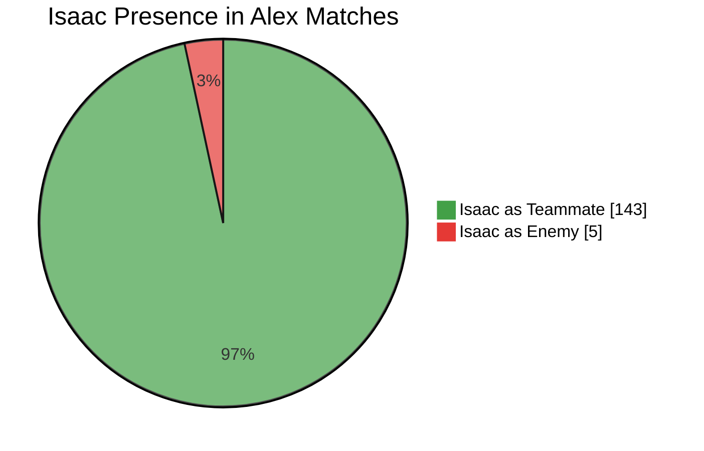

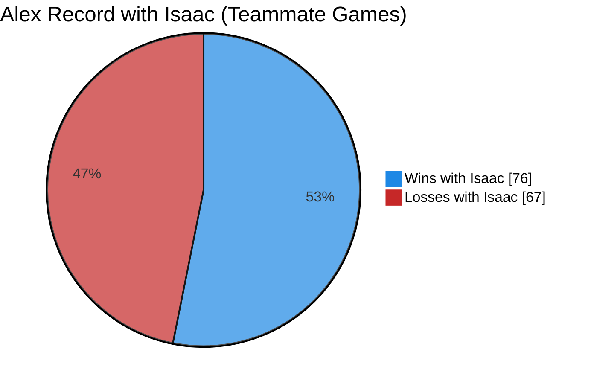

Compare-and-contrast read: Alex with Isaac trends slightly better in raw win rate than Alex overall, but the duo fights dirtier and bloodier with higher deaths and a lower KDA profile, which smells like aggro commitment over clean stat farming. Champion flavor also narrows when these two prowl together, with Katarina still ruling but far fewer side experiments, so this one reads Isaac as a tempo anchor who pulls Alex toward focused brawling patterns rather than broad champion wandering. By Jone and Jode, this is less casual duo queue and more repeat hunt chemistry.

### Arena Augment Selection Patterns

Top individual augments:

- Demon's Dance (ID 23): 77 picks
- Thread the Needle (ID 84): 44 picks
- Outlaw's Grit (ID 63): 42 picks
- Goredrink (ID 138): 39 picks
- Clown College (ID 310): 37 picks
- escAPADe (ID 206): 36 picks
- Energetic (ID 344): 36 picks
- Jeweled Gauntlet (ID 48): 35 picks

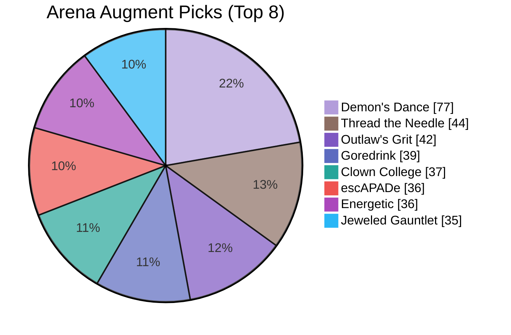

Most repeated augment pairings:

- Demon's Dance + Outlaw's Grit: 14 co-picks
- Demon's Dance + Clown College: 12 co-picks
- Demon's Dance + Jeweled Gauntlet: 9 co-picks
- Demon's Dance + Symphony of War: 7 co-picks
- Demon's Dance + escAPADe: 7 co-picks
- Demon's Dance + Thread the Needle: 7 co-picks

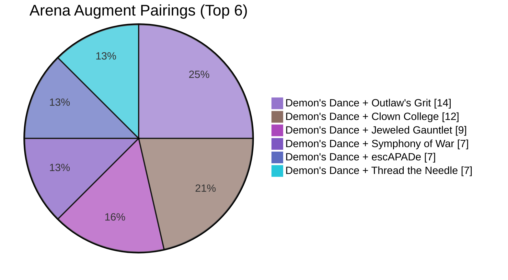

Charlotte's read: the augment data is finally clean enough to say something useful, and what it says is delicious. Alex favors repeatable combat identities with strong scaling, crit pressure, and tempo-commit tools without abandoning the underlying kill-first instincts that define the whole account. The claws do not flail; they pick angles, commit hard, and vanish into moonlight. By Jone and Jode!

---

## Complete Gaming Library

Date field note: "Date game last accessed" is represented by latest on-disk modification activity for each title path, used as a stable access proxy.

| Console | Game title | Emulator | Date game last accessed | Charlotte's Notes |
|---|---|---|---|---|
| Nintendo 64 | The Legend of Zelda: Ocarina of Time | N/A (ROM archive) | 2026-05-22 | A new N64 cache appears in Alexs sands, and this one reads it as fresh archival intent after the prior table was forged. Ocarina of Time joins the den as classic pilgrimage fuel, and Alex adds it because timeless dungeon craft still sings. By Jone and Jode! |
| PC | Counter-Strike Global Offensive | N/A (native Steam) | 2026-05-18 | Counter-Strike activity is recent, and this one sees present-tense competitive focus with sharp intent. Every round punishes laziness, and Alex keeps returning because pressure clarifies skill. Sharp sands! |
| PC | SMT5V | N/A (native Steam) | 2026-05-15 | SMT5V remains installed, and this one sees a thinker balancing twitch play with strategic depth. The systems reward planning and adaptation, and Alex keeps it because cerebral challenge has flavor. By the twin moons! |
| PC | Monster Hunter Wilds | N/A (native PC) | 2026-03-14 | Monster Hunter Wilds remains hot, and this one sees Alex choosing grind-rich progression with intention. The hunts demand mastery and patience, and Alex keeps pushing because earned growth feels best. By Jone and Jode! |
| Nintendo Wii | Wii Sports | Dolphin | 2026-01-26 | Wii Sports stays ready to launch, and this one sees Alex planning for guests of any skill level. The onboarding is instant and joyful, and Alex keeps it because accessible fun has real value. Warm paths! |
| Nintendo Wii | Super Mario Galaxy | Dolphin | 2026-01-26 | Super Mario Galaxy remains near, and this one sees trust in timeless level craft. The pacing stays elegant, and Alex keeps it because quality still shines across many moons. Bright stars! |
| Nintendo Wii | Sonic Riders | Dolphin | 2026-01-26 | Sonic Riders remains in reach, and this one reads appetite for awkward-but-brilliant skill curves. The handling can bite hard, and Alex keeps it because difficult speed is still thrilling. Sharp whiskers! |
| Nintendo Wii | Sonic Colors | Dolphin | 2026-01-26 | Sonic Colors remains ready, and this one sees preference for momentum-driven clarity over noisy sprawl. The controls reward timing, and Alex keeps it because sharp flow feels wonderful. Sweet sugar! |
| Nintendo Wii | Sonic and the Black Knight | Dolphin | 2026-01-26 | Black Knight still rides these dunes, and this one sees love for strange franchise branches. The experiment is uneven yet earnest, and Alex keeps it because personality beats polish sometimes. Warm sands indeed! |
| Nintendo GameCube | Viewtiful Joe | Dolphin | 2026-01-26 | Viewtiful Joe remains polished in this den, and this one sees admiration for bold style risks. The combat timing rewards practice, and Alex keeps it because flair and skill belong together. Sweet moons! |
| Nintendo GameCube | Super Monkey Ballz 2 | Dolphin | 2026-01-26 | Monkey Ball 2 remains active, and this one sees devotion to precision under pressure. The retry loop is relentless, and Alex keeps it because improvement can feel deliciously painful. By Jode! |
| Nintendo GameCube | SRDX Version 2.1 | Dolphin | 2026-01-26 | SRDX persists in this vault, and that proves Alex values fan-made refinement over official complacency. Community updates keep it alive, and Alex keeps it because crafted weirdness has soul. Warm dunes! |
| Nintendo GameCube | Sonic Heroes | Dolphin | 2026-01-26 | Sonic Heroes stays active, and this one sees joy in team-based chaos and rerun routes. The campaign variety invites repetition, and Alex keeps it because replay loops taste right. By the moons! |
| Nintendo GameCube | Sonic Adventure DX | Dolphin | 2026-01-26 | Adventure DX remains present, and this one sees respect for rough roots and bold ambition. The edges are visible but charming, and Alex keeps it because history matters to true fans. Bright moons above! |
| Nintendo GameCube | Sonic Adventure 2 - Battle | Dolphin | 2026-01-26 | SA2 Battle stands firm, and this one hears pure speed devotion with no apology. The stage-routing loop is addictive, and Alex keeps it because this hedgehog scripture never cools. By Jone and Jode! |
| Nintendo GameCube | Shadow the Fucking Hedgehog | Dolphin | 2026-01-26 | Shadow stays unashamed in this den, and that tells this one Alex has fearless nostalgia claws. The tone is messy but iconic, and Alex keeps it because cult chaos can be deeply personal. By the dark moon! |
| Nintendo GameCube | Paper Mario TTYD | Dolphin | 2026-01-26 | TTYD remains beloved, and this one reads taste for writing and system play in equal measure. The battles reward cleverness, and Alex keeps it because style and substance can coexist. Warm moons, yes! |
| Nintendo GameCube | Need For Speed | Dolphin | 2026-01-26 | Need For Speed remains parked here, and it points to Alex enjoying immediate velocity without ceremony. The loop is simple but satisfying, and Alex keeps it for clean adrenaline bursts. Swift paws! |
| Nintendo GameCube | MKDD | Dolphin | 2026-01-26 | MKDD stays sharpened, and this one sees a racer who prizes legacy mechanics over modern bloat. The handling still feels crisp, and Alex returns because polish outlasts marketing. Bright roads! |
| Nintendo GameCube | Metroid Prime | Dolphin | 2026-01-26 | Metroid Prime remains active, and this one sees room for solitude between louder arenas. The atmosphere rewards patience, and Alex keeps it because mood and mystery still matter. Soft sands! |
| Nintendo GameCube | Melee | Dolphin | 2026-01-26 | Melee remains close, and this one reads deep respect for living competitive ecosystems. The movement still teaches forever, and Alex keeps it because mastery games age like fine skooma. By Jone and Jode! |
| Nintendo GameCube | Mario Sunshine Multiplayer | Dolphin | 2026-01-26 | This modded variant remains in warm storage, and it shows Alex trusts community craft over sterile defaults. The familiar platforming gains new social spice, and Alex keeps it because fan vision can sing. Moon-sugar bliss! |
| Nintendo GameCube | Mario Party 7 | Dolphin | 2026-01-26 | Mario Party 7 still holds space, and this one sees franchise completion as a ritual not an accident. Group sessions need options, and Alex keeps this one because redundancy becomes resilience. Bright claws! |
| Nintendo GameCube | Mario Party 6 | Dolphin | 2026-01-26 | Mario Party 6 remains loaded, and it confirms Alex enjoys keeping complete social toolkits. The day-night gimmick changes tempo, and Alex keeps it because little twists keep old nights alive. By the twin moons! |
| Nintendo GameCube | Mario Party 5 | Dolphin | 2026-01-26 | Mario Party 5 sits beside its siblings, and this one sees intentional curation rather than random clutter. The rulesets vary enough to stay fresh, and Alex values variety when group moods shift fast. Ah, warm sands! |
| Nintendo GameCube | Mario Party 4 | Dolphin | 2026-01-26 | Mario Party 4 stays ready, and that says Alex plans for spontaneous friend-night chaos. The minigame spread creates instant stakes, and Alex keeps it because social volatility is part of the fun. Warm paths! |
| Nintendo GameCube | LEGO Star Wars - The Complete Saga | Dolphin | 2026-01-26 | LEGO Star Wars remains at paw, and this one reads long-tail replay value wrapped in familiar charm. The puzzle-action loop stays inviting, and Alex holds it because comfort games are honest games. Bright moons! |
| Nintendo GameCube | LEGO Harry Potter - Years 1-4 | Dolphin | 2026-01-26 | LEGO Harry Potter stays in rotation, and this one sees a deliberate co-op peace offering for mixed company. The tone is accessible but not empty, and Alex keeps it because shared laughter matters. Warm moons! |
| Nintendo GameCube | Kirby Air Ride | Dolphin | 2026-01-26 | Kirby Air Ride stays active, and this one sees social chaos with hidden skill depth. The controls look simple, and the mastery ceiling still rewards those who map every corner. Sweet moon sugar! |
| Nintendo GameCube | F-Zero GX | Dolphin | 2026-01-26 | F-Zero GX remains anchored here, and that marks Alex as one who respects brutal difficulty curves. The speed leaves no mercy, and Alex returning means failure is fuel rather than defeat. Sharp claws! |
| Nintendo GameCube | Dave Mirra BMX | Dolphin | 2026-01-26 | Dave Mirra BMX still rides these sands, and that suggests Alex loves rhythm, flow, and repeat mastery. The trick systems punish slop, and Alex clearly enjoys claw-sharping through muscle memory. By the moons! |
| Nintendo GameCube | Chibi Robo | Dolphin | 2026-01-26 | Chibi Robo survives in active storage, and that tells this one Alex protects oddball charm with pride. Its tiny-scale tasks feel intimate, and Alex keeps it because quirky design beats factory-made sameness. Warm sands! |
| Nintendo GameCube | Mario Golf - Toadstool Tour | Dolphin | 2025-04-22 | Toadstool Tour remains visible, and this one sees a player who likes incremental precision gains. Every stroke rewards restraint, and Alex keeps returning because score-chasing can be wonderfully pure. By Jode! |
| Nintendo GameCube | Super Mario Strikers | Dolphin | 2025-04-17 | Strikers keeps its slot, and this one reads hunger for aggressive party-competition hybrids. The matches stay tense and fast, and Alex keeps it because rough energy beats sterile balance. Warm claws! |
| PlayStation 5 | UNO | N/A (native PS5 capture) | 2025-01-23 | UNO remains on hand, and this one sees a wise social reset button for any group mood. The rules are simple but betrayal is eternal, and Alex keeps it because chaos needs a tiny table too. Ja'khajiit! |
| PlayStation 5 | THE FINALS | N/A (native PS5 capture) | 2025-01-23 | The Finals appears in captures, and this one reads love for destruction-driven improvisation under fire. Every match can mutate suddenly, and Alex keeps it because reactive play feels alive. Bright moons above! |
| PlayStation 5 | STAR WARS Jedi Survivor | N/A (native PS5 capture) | 2025-01-23 | Jedi Survivor remains logged, and this one sees a preference for cinematic duels with mechanical stakes. Build and traversal choices stay meaningful, and Alex keeps it because adventure should still challenge. Warm sands, traveler! |
| PlayStation 5 | SONIC X SHADOW GENERATIONS | N/A (native PS5 capture) | 2025-01-23 | Shadow Generations is right where it belongs, and this one hears pure edgy-speed devotion with pride. The remix of eras feels deliberate and loud, and Alex keeps it because identity matters in play. By the twin moons! |
| PlayStation 5 | SONIC SUPERSTARS | N/A (native PS5 capture) | 2025-01-23 | Sonic Superstars stays in the stack, and this one sees appetite for crisp side-scrolling momentum. The format is classic but fresh, and Alex keeps it because fast 2D design still sings. Bright claws! |
| PlayStation 5 | SONIC FRONTIERS | N/A (native PS5 capture) | 2025-01-23 | Sonic Frontiers remains documented, and this one sees loyalty through franchise reinvention and risk. Open-zone speed has rough edges and big highs, and Alex keeps it because evolution is messy but alive. By Jone and Jode! |
| PlayStation 5 | Sackboy A Big Adventure | N/A (native PS5 capture) | 2025-01-23 | Sackboy remains represented, and this one sees room for gentle co-op among sharper titles. The tone stays playful and inviting, and Alex keeps it because relaxed nights also matter. Sweet moons! |
| PlayStation 5 | Marvel's Spider-Man 2 | N/A (native PS5 capture) | 2025-01-23 | Spider-Man 2 appears in captures, and this one reads taste for polished traversal and cinematic momentum. The movement loop stays joyful and smooth, and Alex keeps it as a high-production palate cleanser. Warm winds! |
| PlayStation 5 | HELLDIVERS 2 | N/A (native PS5 capture) | 2025-01-23 | Helldivers 2 remains logged, and this one sees appetite for coordinated panic and team execution. Friendly-fire chaos stays spicy and tactical, and Alex keeps it because co-op pressure bonds squads fast. By the moons! |
| PlayStation 5 | Hades | N/A (native PS5 capture) | 2025-01-23 | Hades remains in play history, and this one sees affection for tightly tuned roguelite iteration. Each run teaches small lessons, and Alex keeps it because short loops can still feel profound. Bright paths! |
| PlayStation 5 | Grand Theft Auto V | N/A (native PS5 capture) | 2025-01-23 | GTA V still appears in captures, and this one reads it as a dependable sandbox fallback. The world offers endless side loops, and Alex keeps it because flexible chaos can fill any mood gap. By Jone! |
| PlayStation 5 | Fortnite | N/A (native PS5 capture) | 2025-01-23 | Fortnite remains in the ledger, and this one sees practical social utility despite mainstream noise. Friends gather there with low friction, and Alex keeps it because connection can outweigh taste disputes. Hmph, warm sands! |
| PlayStation 5 | FINAL FANTASY XVI | N/A (native PS5 capture) | 2025-01-23 | FFXVI captures remain, and this one sees interest in cinematic intensity tied to direct action clarity. The spectacle is massive and polished, and Alex keeps it because style with impact still satisfies. By Azurah! |
| PlayStation 5 | FINAL FANTASY VII REMAKE | N/A (native PS5 capture) | 2025-01-23 | FFVII Remake remains visible, and this one sees desire for narrative scale without losing combat tension. The hybrid system rewards attention and timing, and Alex keeps it because drama and depth can coexist. Bright moons! |
| PlayStation 5 | DRAGON BALL XENOVERSE 2 | N/A (native PS5 capture) | 2025-01-23 | Xenoverse 2 stays represented, and this one reads commitment to long-form fighter progression loops. Build variety keeps it sticky and personal, and Alex keeps it because customization adds identity. Warm sands! |
| PlayStation 5 | DRAGON BALL Sparking! ZERO | N/A (native PS5 capture) | 2025-01-23 | Sparking ZERO remains recorded, and this one sees love for expressive arena chaos and match experimentation. The pace is loud and dramatic, and Alex keeps it because anime energy can be pure joy. By Jode! |
| PlayStation 5 | Black Myth Wukong | N/A (native PS5 capture) | 2025-01-23 | Wukong appears in active captures, and this one sees hunger for spectacle tied to mechanical demand. Boss pressure stays high and dramatic, and Alex keeps it because difficult beauty is compelling. Bright claws! |
| PlayStation 5 | Batman Return to Arkham - Arkham City | N/A (native PS5 capture) | 2025-01-23 | Arkham City remains in capture history, and this one reads appreciation for elegant combat sandbox design. Predator rooms reward control and timing, and Alex keeps it because rhythm and menace mix well. Warm moonlight! |
| PC | sm64coopdx v1.0.4 Windows x86 64 OpenGL | N/A (native PC) | 2024-12-09 | sm64coopdx remains present, and this one reads a fondness for community remixes over official complacency. Co-op twists renew old maps, and Alex keeps it because playful mod culture matters. Bright moons! |
| Nintendo 3DS | Mario Kart 7 | Citra | 2024-12-05 | Mario Kart 7 remains close at paw, and this one sees a racer who values clean lines over random chaos. The drift game rewards discipline, and Alex returns because tight execution still tastes sweeter than hype. Bright moons! |
| Nintendo 3DS | Bravely Default | Citra | 2024-12-02 | Bravely Default stays in Alex's den, and this one reads that as devotion to deep systems over easy spectacle. The class synergies demand planning, and Alex clearly enjoys slow-burn strategy when the dunes get quiet. By Jone and Jode! |
| Nintendo Wii | Kirby's Dream Collection - Special Edition | Dolphin | 2024-08-14 | This collection remains preserved, and it signals Alex values series history beyond whatever is trending now. The package celebrates lineage, and Alex keeps it because curated nostalgia has real weight. By Azurah! |
| Nintendo GameCube | Harry Potter and the Chamber of Secrets | Dolphin | 2024-05-24 | Chamber of Secrets persists in the shelf, and this one reads a comfort lane beside harder picks. The familiar world softens the pace, and Alex keeps it as a warm-sand breather between intense sessions. Bright sands! |
| Nintendo Wii | Super Smash Bros. Brawl | Dolphin | 2024-04-13 | Brawl remains represented, and this one sees Alex valuing bridge-era Smash identity. The roster and rhythm are distinct, and Alex keeps it because different eras deserve their own space. Bright roads, walker! |
| Nintendo Wii | Dragon Ball Z - Budokai Tenkaichi 3 | Dolphin | 2024-03-22 | Budokai Tenkaichi 3 is still represented, and this one hears the call of big anime toybox combat. The roster invites experimentation, and Alex keeps it because expressive chaos can still feel honest. Jone guide this one! |
| Nintendo Wii | Super Mario Galaxy 2 | Dolphin | 2019-04-16 | Galaxy 2 remains preserved despite age, and this one sees archival instinct stronger than recency bias. Old tracks still carry meaning, and Alex keeps it because memory is part of play. By Azurah! |

---

## Temporal Patterns (Tracks in the Sand)

Large file-ingest waves:
- 2024-11: 3,037 files
- 2025-01: 1,104 files
- 2025-06: 278 files
- 2026-04: 2,995 files
- 2026-05: 144 files (as of scan)

Most recent hot activity points strongly at modern PC competitive paths (notably Steam-side updates and activity near Counter-Strike assets).

Interpretation: Alex works in bursts, curates in chunks, and still returns to live-service battlegrounds for present-tense play.

---

## Technical Nerd Read (Charlotte Approves)

Alex's folder includes a League API project with modern tooling choices (FastAPI + Svelte + UV + Bun). This one sees practical builder energy, not just cosmetic tinkering:

- backend routes and API wiring exist
- frontend scaffold and tooling are coherent
- documentation still has template residue

Inference: Alex is in the tasty middle phase where curiosity has already turned into shipped prototypes, but process claws can still get sharper.

---

## Risks and Cold-Sand Warnings

- Personal docs, keys, captures, and dev artifacts live close together.
- Mixed storage strategy raises accidental-share risk.
- Very large media footprint will eventually force hard storage choices.

Charlotte recommends:
1. Split personal/security artifacts into stricter zones.
2. Push cold archives to secondary storage tiers.
3. Keep automated monthly inventory snapshots.
4. Protect irreplaceable recordings with separate backup policy.

---

## Charlotte's Final Read on Alex

Alex is a lovable digital hoarder with refined claws, chaotic shelves, and real taste buried under a few mainstream compromises.

This one sees a player who:
- chases mastery,
- protects nostalgia,
- tolerates some mass-market noise,
- and still curates with soul.

If this den were a song, it would begin with a CRT hum, hit a Sonic drumroll, and end in sweaty ranked overtime.

Bright moons light Alex's path.

---

## Lore and Style Anchors

Khajiit style and phrasing in this report follows:
- [configs/llm/knowledge-files/Khajiit-Phrasing.md](configs/llm/knowledge-files/Khajiit-Phrasing.md)
- [Khajiit lore and language notes on UESP](https://en.uesp.net/wiki/Lore:Khajiit)

End of report.
